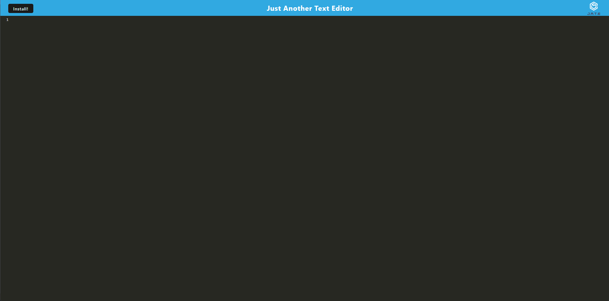

# JATE  

## Table of Contents  
* [Description](##Description)  
* [Installation](##Installation)  
* [Usage](##Usage) 
* [License](##License)  
* [Contact](##Contact)  

## Description

Jate is a text editor application. It was created with progressive web standards. Jate can be downloaded and includes a service worker. Jate is an application that can be used for all your writing needs.

## Installation

To go to the webpage go to https://git.heroku.com/service-worker-bootcamp.git. Then hit the download button at the top of the screen to download the program.

## Usage

Jate is to be used to help write and edit any text someone needs. Type anything you would like into the text editor. Then that information will be saved for future reference.

## License

No license

---

## Contact
Gayle Hoefer - [LinkedIn](https://www.linkedin.com/in/gayle-hoefer-61a2a3124/) - [Github](https://github.com/hoeferg)
